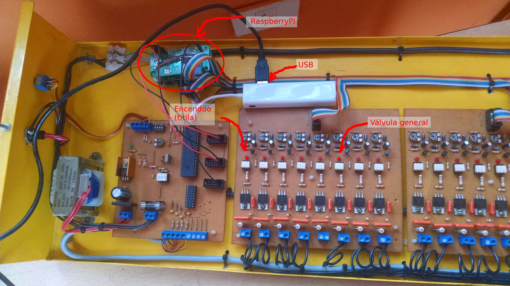
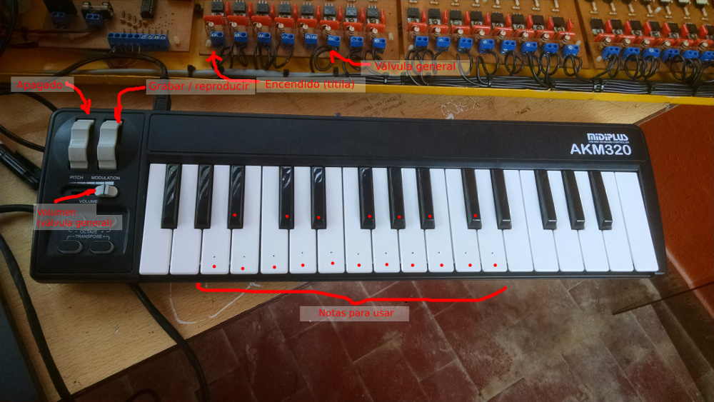

# carrillon
This code runs in a Raspberry Pi Zero, and controlls an 18 bells pneumatic bell tower, using two [IO Pi Zero boards](https://www.abelectronics.co.uk/p/71/io-pi-zero) and then a driver module composed of triacs.

The bell tower is located in La Fiesta Nacional de la Flor in Escobar, Buenos Aires, Argentina.


And this is the setup. 24 channels controller driven by a RaspberryPi using two IO Pi Zero hats, and the MIDI Keyboard connected to the setup, so we can play live, and also record songs.




Most of the "system" is implemented in [carrillon.py](carrillon.py), where Midi events are translated into GPIOs and also "menu options" to control the system to do things like recording a song, replaying a song, turning on and off the main air pressure pump, resetting the system or live playback.

The file [live.py](live.py) contains the mapping between Midi events and GPIO ports, and also a very crude live playback feature, mapping qwerty key presses to bells.

[IOPi.py](IOPi.py) is a librarayr accompaning the IO Pi Zero boards, it requires `python-smbus` to access the I2C bus.

[midi2tcp.py](midi2tcp.py) is a proxy that will create a virtual Midi port called "Carrillon" and 
then will listen on port 8383 for incoming TCP connections. When a client is connected, all incoming
Midi messages will be forwarded to the TCP connection. It can handle only 1 TCP conneciton at a time,
if a second connection is received while another client is connected, the second connection will be
honored, and the first will be closed.

To try it very raw, you can use `netcat` (`nc`) and `aplaymidi` in three terminals, as in:

```
(term 1) $ python midi2tcp.py
Listening at port 8383
```

```
(term 2) $ nc -v 0 8383
Connection to 0 8383 port [tcp/*] succeeded!
```

```
(term 3) $ aconnect -l
client 0: 'System' [type=kernel]
    0 'Timer           '
    1 'Announce        '
client 14: 'Midi Through' [type=kernel]
    0 'Midi Through Port-0'
client 128: 'RtMidiIn Client' [type=user,pid=14301]
    0 'Carrillon       '

(term 3) $ aplaymidi --port 128 anysong.mid
```

```
(term 1) $ ./midi2tcp.py 
Listening at port 8383
Received connection from: ('127.0.0.1', 57012)
Listening at port 8383
Sending:L b'\x03\x92C]'
Sending:L b'\x03\x92C\x00'
Sending:L b'\x03\x92@]'
Sending:L b'\x03\x92@\x00'
^C
```

```
(term 2) $ nc -v 0 8383
Connection to 0 8383 port [tcp/*] succeeded!
�C]�C�@]�@
```


The project also depends on `python-rtmidi` and uses external `aconnect`, `aplaymidi` and `arecordmidi` from package `alsa-utils` to play and record songs.
