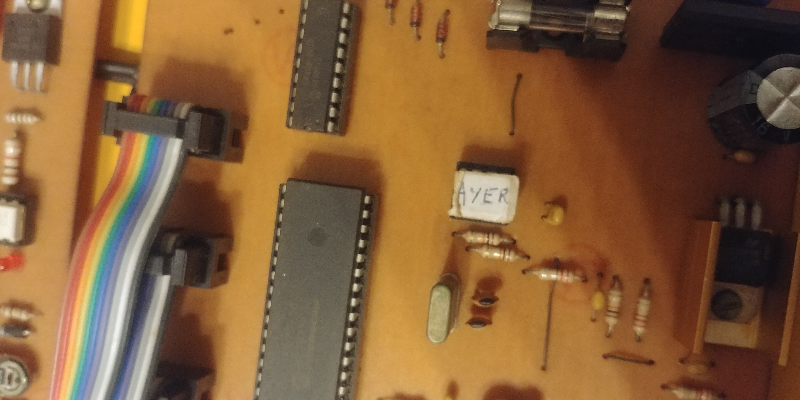
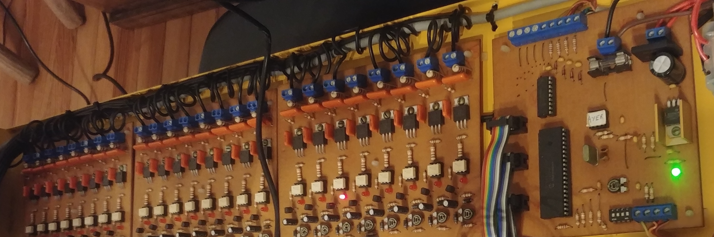
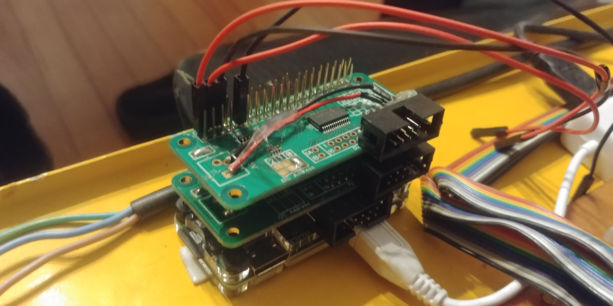
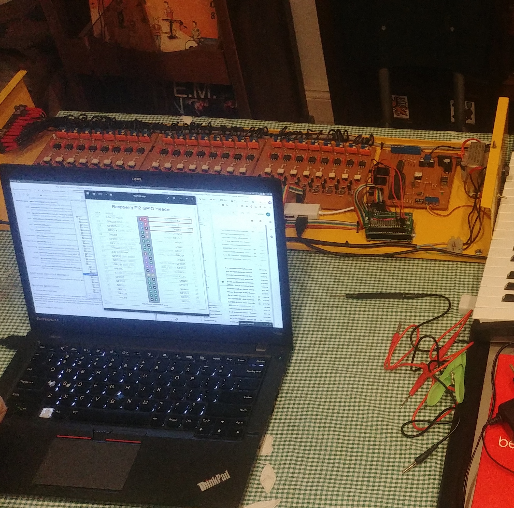
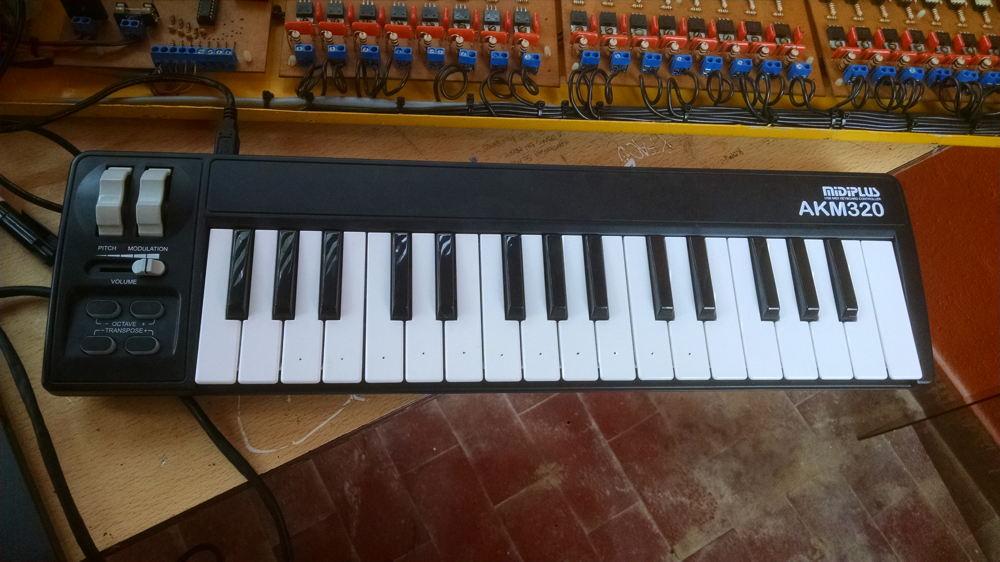
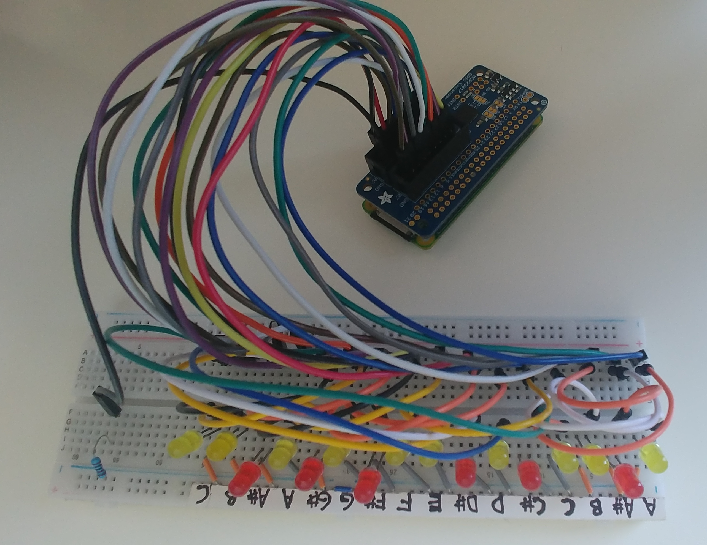
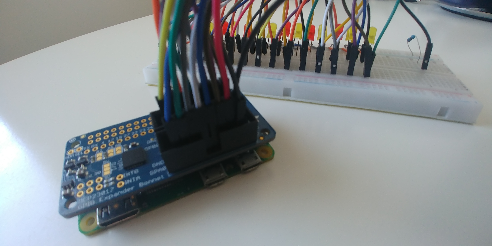

<p align="center">
 <h1 align="center">El Carrillon</h1>
  <p align="center">
    Powering the world’s largest MIDI instrument
    <br>
    <a href="doc/"><strong>Explore the docs »</strong></a>
    <br>
    <br>
    <a href="https://github.com/gerasdf/carrillon/issues/new?labels=Type%3A+Defect">Report a defect</a>
    |
    <a href="https://github.com/gerasdf/carrillon/issues/new?labels=Type%3A+Feature">Request feature</a>
  </p>
</p>


There’s a huge yearly event held in Argentina, called [Fiesta Nacional de la Flor](http://www.fiestadelaflor.org.ar/web/) (National Flower Festival) organized by an NGO.  Many years ago, they created a hardware to control 18 tuned bells. Each bell is associated with a musical note, from A3 to D5 with all the semitones. “El Carrillón” is the spanish word for “Bell Tower”.


The hardware setup includes a Raspberry Pi Zero, two IO Pi Zero boards and a driver module composed of triacs. The software is developed with VA Smalltalk and some Python and the goal is to allow playing MIDI songs on the bell tower.

## The Early History Of El Carrillon

Originally, the bell tower code was written in Assembly and there was a chip on the board labeled “Ayer” (Spanish for “Yesterday”) that held a rendition of The Beatles’ song. Unfortunately, this was the only song available for playback. At least the EPROM chip was placed in a socket, so theoretically you could change the song by swapping it.



A couple years ago, we wanted to improve the bell tower by making it easier to maintain with newer hardware and software, and have the flexibility to easily change the song that was played. So got to work.

The first step was to examine the original design. It had a PCB controller (Printed Circuit Board) and three power driver boards, each with 8 channels. The boards were connected with 3 flat cables, 10 connectors each.



The 3 flat ribbon cables that are referenced are rainbow colored.

It was clear that the PIC microprocessor and the EPROM memory module of the original PCB would not be needed when using a [Raspberry Pi](https://www.adafruit.com/product/3409). In fact, even though the PCB was left in the case, it wasn’t needed at all except for the GND connections that were reused. If desired, the PCB could be removed completely and new grounds added. Aside from a single Raspberry Pi Zero, two “hacked and stacked” [IO Pi Zero boards](https://www.abelectronics.co.uk/p/71/io-pi-zero) (each with an MCP23017 GPIO expander) and a pre-existing driver module composed of triacs were all connected together.


Each IO expander gives us 16 GPIOs with a total of 24 channels (18 bells, plus a general pump, and some spares). Two [right-angled headers](https://articulo.mercadolibre.com.ar/MLA-704527535-tira-pines-macho-angulo-recto-2x40-paso-254mm-largo-11mm-_JM) and an extra GND wire were needed also.

Luckily, the power driver board and the flat cables could remain untouched and be reused. The pinout could be easily adapted to the IO Pi Zero boards by just soldering right-angled headers to them. After that, we needed to plug all existing cables into the IO Pi Zero expanders. Once the Pi was connected to all the drivers, the hardware was done. All we needed to do now was the software.





There is a [MIDI keyboard](https://www.amazon.com/gp/product/B00VHKMK64) connected to the setup too, so a user can play live, and also record songs. A [USB hub](https://www.adafruit.com/product/2909) was used to connect the keyboard to the Pi.



The Assembly code originally being run by the PIC processor was replaced with a higher level language (Python) for ease of development. However, it was soon migrated mostly to VA Smalltalk. [VA Smalltalk](https://www.instantiations.com/products/vasmalltalk/index.html) is a software development platform sold by [Instantiations Inc](https://www.instantiations.com/). They granted us an open-source license for this non-profit project.

The web application, GPIO wrapping, MIDI interpreter/events, I2C driver for the MCP23017 chip (the IO Pi Zero) are all currently running with VA Smalltalk.

Smalltalk gave the project a pure Object-Oriented platform to run on that’s simple and powerful. We’ve found that VA Smalltalk’s live programming environment works really well for fast, iterative development and makes software updates quick and easy without the need for recompilation like lower level languages would need (Assembly, C / C++). Performance-wise, it more than exceeds the needs of this kind of project.

Now with the new hardware and software, you can play any MIDI file on the Raspberry Pi and the notes of the song will be mapped to the tuned bells. The last step was to add a web interface for controlling, configuring and playing songs, so “anyone” could play the songs from their mobile phone.


## Tests, TDD and Mocking

We apply TDD (Test Driven Development) when possible and we wrote many unit tests to allow for rapid development/debugging, including basic device mocking to test the MCP23017 driver implementation, as shown in the following example:

```smalltalk
testPulseCompleted
	port pulseForMilliseconds:5.
	out reset.
	self
		assert: out next equals: 16r12;
		assert: out next equals: 2;
		assert: out atEnd.
	(Delay forMilliseconds: 7) wait.
	out reset.
	self
		assert: out next equals: 16r12;
		assert: out next equals: 2;
		assert: out next equals: 16r12;
		assert: out next equals: 0;
		assert: out atEnd.
```


One particular challenge was how to test the project without needing to go to the physical bell tower and test with the real bells. To address this, we’ve built an LED piano “display” on a protoboard that resembles the exact same layout as the Carrillón. Each LED represents a note and each note is mapped to a bell, so we could play MIDI songs at home and see those on the LED piano. We also used FluidSynth (MIDI software synthesizer) to hear the songs while developing.






## License
- The code is licensed under [MIT](LICENSE).
- The documentation is licensed under [CC BY-SA 4.0](http://creativecommons.org/licenses/by-sa/4.0/).


## Installation

See [this page](web/SetupCarrillonWeb.md) for more details about how to setup OS dependencies, the Raspberry Pi, how to load the code, etc.  


## Blog posts, awards and conferences
- [Developing, testing and mocking the largest MIDI instrument of the world with a Raspberry Pi and a DIY LEDs piano](https://dev.to/martinezpeck/developing-testing-and-mocking-the-largest-midi-instrument-of-the-world-with-a-raspberry-pi-and-a-diy-leds-piano-7el)
- [El Carrillon: playing MIDI songs on an 18-bell tower with a Raspberry Pi and Smalltalk](https://dev.to/martinezpeck/el-carrillon-playing-midi-songs-on-an-18-bell-tower-with-a-raspberry-pi-and-smalltalk-3f1f)
- [Presentation at Smalltalks 2019](https://youtu.be/5HnxUGA0ZlE?t=2057)
- [Won 3rd place at the Innovation Technology Awards at ESUG 2019](https://esug.github.io/2019-Conference/awardsSubmissions.html)
