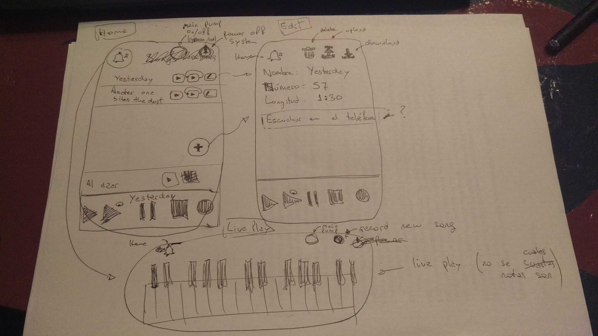

La idea es tener una aplicación Web que sea accesible desde un teléfono para poder controlar el carrillón.

La funcionalidad básica es tocar canciones, y permitir grabar canciones. También seriviría tener una
utilidad para poder probar GPIO por GPIO, que podría usarse para tocar en vivo, pero dudo que sirva
por los delays. Ya veremos, quizás se puede hacer algo para que no sea tan lenta la respuesta.

Cuatro pantallas en la App

* Home
* Edit (song)
* Live Play
* Settings

## Home

Tiene una lista de canciones y unos controles básicos para apagar el sistema, prender y apagar
una bomba principal que hay, y para tocar (play) o editar una canción. La lista de canciones
tiene un scroll, supongo.

Abajo siempre hay un player (play, play loop, pause, stop).

* El + agrega una nueva canción y va a la pantalla de edición
* El ícono de Edit en cada canción es para editar la metadata de la canción.
* El triangulito en cada canción la toca una vez.
* El triangulito con loop, la toca en loop
* El botón de la campanita va a "Live Play"
* La tuerca (ícono) va a settings
* El ícono circular al lado del power sirve para prender y apagar la bombá de aire principal (cambia de color)
* El Power apaga la raspi

Esto ya se podría hacer (salvo lo de "live play").

Tal cual la aplicación vieja, cuando elijen Play, ejecuta `aplaymidi` y cuando stop, mata el proceso.
Si eligen loop play ejecuta `loopplay.sh`. 

## Edit

Nombre básicamente, y a que tecla del piano está asignada (para poder seguir usando la cosas sin
necesidad de conectarse, o eso les parece que no tiene sentido?)

Eso ya funcionaría, y es un gran avance de lo que hay hoy
cuando aprietan record ejecuta `arecordmidi`. 

El botón de la campanita vuelve al home, o va del homa a "live play"

## Live Play

## Settings

* Tocar cada hora (si/no)
* Tocar cada 1/4 de hora (si/no)
* Horario y días para tocar
* elegir que canción tocar cada hora
* no se que otros settings veremos

